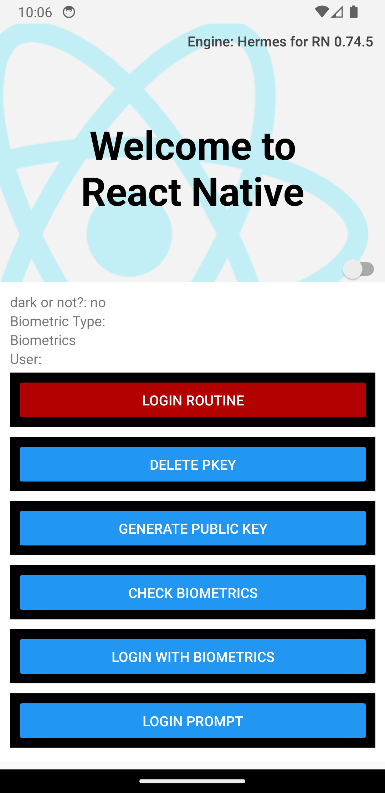

# React Native Biometrics
Sample code for implementing biometrics, this example code will get you up to speed on how to integrate it in your own [**React Native**](https://reactnative.dev) project. 


# Getting Started

>**Note**: This code utilizes [React-Native-Biometrics](https://www.npmjs.com/package/react-native-biometrics) plugin and the [react-native-keychain](https://www.npmjs.com/package/react-native-keychain/v/3.0.0) plugin to get the job done.

## Before we run the code
be sure to clone the repo to your localhost. After that, follow the steps to get going.



## Step 1: Install Dependencies

I will be using NPM to run the project, but you can use yarn if you like. On your terminal run the following code.

```bash
# using npm
npm install
```

## Step 2: Recreate iOS and Android folders

You will need to install [React-Native-Eject](https://www.npmjs.com/package/react-native-eject) to recreate the folders. Once you have installed the plugin, run this code: `npx react-native run eject` After you have recreated both folders link the files.

### For Android

```bash
# using rn cli
npx react-native start link
```

### For iOS

```bash
# using rn cli
cd ios && pod install && cd ../
```

If everything is set up _correctly_, you should see the app running in your _Android Emulator_ or _iOS Simulator_ shortly provided you have set up your emulator/simulator correctly.

This is one way to run your app — you can also run it directly from within Android Studio and Xcode respectively.

or you can run the following commands.

### For Android
```bash
# using rn cli
npx react-native run-android
```
### For iOS
```bash
npx react-native run-ios
```

## Step 3: Modifying the App

Now that you have successfully run the app, let's modify it.

1. Open `App.tsx` in your text editor of choice and edit some lines.
2. For **Android**: Press the <kbd>R</kbd> key twice or select **"Reload"** from the **Developer Menu** (<kbd>Ctrl</kbd> + <kbd>M</kbd> (on Window and Linux) or <kbd>Cmd ⌘</kbd> + <kbd>M</kbd> (on macOS)) to see your changes!

   For **iOS**: Hit <kbd>Cmd ⌘</kbd> + <kbd>R</kbd> in your iOS Simulator to reload the app and see your changes!

## Congratulations! :tada:

You've successfully run and modified your React Native App. :partying_face:

### What you should see


# Troubleshooting

If you can't get this to work, see the [Troubleshooting](https://reactnative.dev/docs/troubleshooting) page.

# Want to expand or contribute?

Send me an email to javivilchis@gmail.com and I will respond back to your message or create a fork and submit it. I believe I have this repo open to public. I will be recreating this app in simple Javascript to make it even easier to understand. Also, shoot me an email if you need any help. Cheers and let's keep on learning.